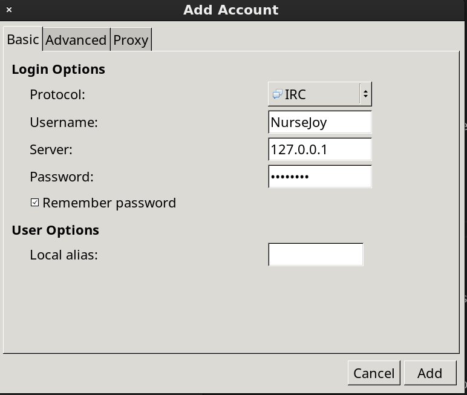
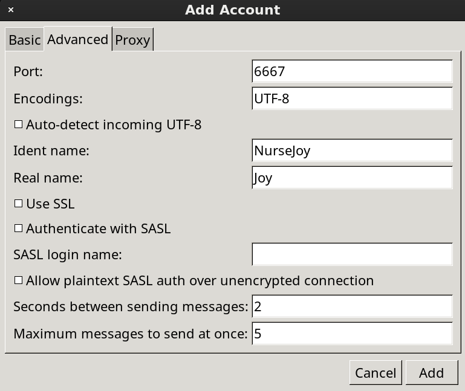

# Intro
> Internet Relay Chat or IRC is a text-based communication protocol on the Internet.
> It offers real-time messaging that can be either public or private. Users can exchange direct messages and join group channels.
> IRC clients connect to IRC servers in order to join channels. IRC servers are connected together to form a network.

This program creates and runs an IRC server. It follows the IRC protocols when communicating with IRC clients and has several bots into its programming to interact with.

## Table of Contents
- [Usage](#Usage)
  - [Client](#Client)
  - [Bots](#Bots)
- [Information](#Information)
  - [Environment](#Environment)
  - [Sockets](#Sockets)
  - [Ports](#Ports)
  - [Poll](#Poll)
  - [Classes](#Classes)
  - [Namespaces](#Namespaces)
- [Sources](#Sources)
- [Creators](#Creators)

# Usage
The server has been designed for Linux, but should compatible with MacOS too.
It can be compiled and run using the following terminal commands.

<table>
	<thead style="background-color: #C0C0C0;">
		<tr><th colspan="3">Terminal Commands</th></tr>
		<tr>
			<th>Command</th>
			<th>Arguments</th>
			<th>Functionality</th>
		</tr>
	</thead>
	<tbody>
		<tr>
			<td><a href="Makefile" target="_blank">make</a></td>
			<td></td>
			<td>Compiles the files into ircserv</td>
		</tr>
		<tr>
			<td>./ircserv</td>
			<td>[port] [password]</td>
			<td>Runs the binary</td>
		</tr>
		<tr>
			<td><a href="Makefile" target="_blank">make</a></td>
			<td>subject</td>
			<td>Compiles the files and runs the binary with port '6667' and password set to 'password'</td>
		</tr>
		<tr>
			<td><a href="nctest.sh" target="_blank">./nctest.sh</a></td>
			<td></td>
			<td>Runs a shell script that in turn runs nc. Automatically logs in into the server</td>
		</tr>
	</tbody>
</table>

## Client
While this server, in theory, is compatible with all IRC Clients that follow the IRC protocol. It has been tested using [Pidgin](https://pidgin.im/) and is fully compatible with it.
To connect with Pidgin make a new Account and set the following settings.
- Set Protocol to '**IRC**'
- Set Username to the desired Nickname
- Set Server to the **Local IP Address** provided by the IRC Server
- Set Password to the password passed to the server

- Set Port(Advanced) to the port passed to the server
- Set Ident name(Advanced) to the desired name
- Set Real name(Advanced) to the desired full name

Alternatively **nc** can be used to connect. This will however require the user to type in full IRC Protocol. The Shell Script [nctest.sh](nctest.sh) can be used to quickly connect to the IRC Server and will register the user and execute a few test commands.

## Bots
While the IRC Server is mainly for client to client communication. It also contains several bots for users to interact with.

<table>
	<thead style="background-color: #C0C0C0;">
		<tr><th colspan="3">Bots</th></tr>
		<tr>
			<th>Main</th>
			<th>Primary Call</th>
			<th>Functionality</th>
		</tr>
	</thead>
	<tbody>
		<tr>
			<td><a href="hdr/ServerBot.hpp" target="_blank">ServerBot</a></td>
			<td>//info</td>
			<td>A bot that only works through private messages. He can provide some general server information and shutdown the server</td>
		</tr>
		<tr>
			<td><a href="hdr/BotTicTacToe.hpp" target="_blank">TicTacBot</a></td>
			<td>//play</td>
			<td>A bot that can play Tic Tac Toe</td>
		</tr>
		<tr>
			<td><a href="hdr/RockBot.hpp" target="_blank">RockBot</a></td>
			<td>//throw</td>
			<td>A bot that can play Rock Paper Scissors</td>
		</tr>
	</tbody>
</table>

# Information
The IRC Server has been written in C++ and runs a server that responds to IRC Protocol messages.

## Environment
The project contains an [.env](.env) file which valuable information about the server.
This includes the server name, the password for admins and the level of verbose.
Whenever this file is changes, the server automatically updates accordingly.

The IRC_VERBOSE setting in .env can be set to adjust the types of output are sent to the standard output.
<table>
	<thead style="background-color: #C0C0C0;">
		<tr><th colspan="3">Verbose Settings</th></tr>
		<tr>
			<th>Setting</th>
			<th>enum</th>
			<th>Message Type</th>
		</tr>
	</thead>
	<tbody>
		<tr>
			<td>0</td>
			<td>V_SILENT</td>
			<td>Silent</td>
		</tr>
		<tr>
			<td>1</td>
			<td>V_ADMIN</td>
			<td>Include Admin messages</td>
		</tr>
		<tr>
			<td>2</td>
			<td>V_DETAILS</td>
			<td>Include Details on construction and deconstruction of users</td>
		</tr>
		<tr>
			<td>3</td>
			<td>V_CHANNEL</td>
			<td>Include Channel events</td>
		</tr>
		<tr>
			<td>4</td>
			<td>V_USER</td>
			<td>Include User events</td>
		</tr>
		<tr>
			<td>5</td>
			<td>V_MSG</td>
			<td>Include all messages sent to and from the Server</td>
		</tr>
	</tbody>
</table>

## Sockets
Using the [int socket()](src/Server.cpp#L190) function, a socket is created for internet communication (**AF_INET**) over which bi-directional communication (**SOCK_STREAM**) is possible.
Using the [int setsockopt()](src/Server.cpp#L194) function, the socket is set to bind a socket, even if the address is already in use.
For MacOS systems the function [int fcntl()](src/Server.cpp#L201) is used to ensure the socket is non-blocking (**O_NONBLOCK**).

## Ports
Then using the [int bind()](src/Server.cpp#L211) function, the socket is bound to the specified port and the function [int listen()](src/Server.cpp#L217) sets it to listen to the port for incoming streams and maintaining a backlog, which can store 128 (**SOMAXCONN**) incoming messages.
The accepted ports have been restricted to avoid usage ports that have predefined uses.

<table>
	<thead style="background-color: #C0C0C0;">
		<tr><th colspan="2">Restricted Ports</th></tr>
		<tr>
			<th>Port</th>
			<th>Usage</th>
		</tr>
	</thead>
	<tbody>
		<tr>
			<td>0 ... 1023</td>
			<td>Well-Known Ports(0-1023)</td>
		</tr>
		<tr>
			<td>1433</td>
			<td>Microsoft SQL Server</td>
		</tr>
		<tr>
			<td>1521</td>
			<td>Oracle Database</td>
		</tr>
		<tr>
			<td>3306</td>
			<td>MySQL Database</td>
		</tr>
		<tr>
			<td>5000</td>
			<td>UPnP (Universal Plug and Play) control point</td>
		</tr>
		<tr>
			<td>5222</td>
			<td>XMPP (Extensible Messaging and Presence Protocol)</td>
		</tr>
		<tr>
			<td>5432</td>
			<td>PostgreSQL Database</td>
		</tr>
		<tr>
			<td>7070</td>
			<td>Real-Time Messaging Protocol (RTMP)</td>
		</tr>
		<tr>
			<td>8080</td>
			<td>Alternate HTTP (commonly used for web servers)</td>
		</tr>
		<tr>
			<td>8443</td>
			<td>HTTPS Alternate (often used for secure web traffic)</td>
		</tr>
		<tr>
			<td>9090</td>
			<td>Alternate Web Server (often used for web proxy servers)</td>
		</tr>
	</tbody>
</table>

## Poll
The chosen function to monitor incomming messages is **poll()**. It is called at two points. In the [Server](src/Server.cpp#L296) to monitor new connections and in the [Client](src/Client.cpp#L129) to monitor for new messages.

## Classes
The bulk of this program consists of classes. There are classes for the [Server](hdr/Server.hpp), [Channels](hdr/Channel.hpp) and the Clients.
The Clients are derived for the abstract class [AClient](hdr/AClient.hpp), from which the bots are also derived. Once a Bot or Client is added the IRC Server no longer differentiates between them.
The Server has been structured so that new Bots can easily be implemented.
They do require definitions for the following public member functions.

<table>
	<thead style="background-color: #C0C0C0;">
		<tr><th colspan="3">AClient Pure Virtual Public Member Functions</th></tr>
		<tr>
			<th>Return</th>
			<th>Public Member Function</th>
			<th>Usage</th>
		</tr>
	</thead>
	<tbody>
		<tr>
			<td>bool</td>
			<td>stillActive(void) const</td>
			<td>Returns whether an Aclient is active</td>
		</tr>
		<tr>
			<td>void</td>
			<td>closeFD(void)</td>
			<td>Clean up function for any File Descriptor or used alternatives</td>
		</tr>
		<tr>
			<td>std::string</td>
			<td>getMsg(void)</td>
			<td>Messages the AClient wants to send to the server</td>
		</tr>
		<tr>
			<td>void</td>
			<td>sendMsg(std::string msg)</td>
			<td>Messages sent to the AClient</td>
		</tr>
	</tbody>
</table>

## Namespaces
Namespace-Based Encapsulation for Command and Parse Functionality

This program utilizes namespaces, namely [Command](hdr/Command.hpp) and [Parse](hdr/Parse.hpp), to organize and encapsulate related functions.

While classes are typically used for encapsulation in C++, we used namespaces as an alternative approach that provides logical grouping and 
enhances code maintainability.Using namespaces we eliminated the need to instantiate objects for accessing commands or parsing functionality, simplifying code usage and reducing memory overhead.

The [Command](src/Command.cpp) namespace employs static functions to restrict their usage within the namespace itself. This effectively prevents unintended external access, simulating private access control. Only the main function is declared in the header file, while the remaining functions are called locally within the source file.

The [Parse](src/Parse.cpp) namespace demonstrates another encapsulation strategy. It declares the main function in the header file and defines it in the source file, while auxiliary functions are declared and defined within an unnamed namespace in the source file. This approach limits the visibility of auxiliary functions to the [parseMsg()](src/Parse.cpp#L54) function, preventing their direct use outside the namespace.

These two namespace implementations showcase different techniques to achieve encapsulation and protect the usage of methods within a namespace context.

# Sources
- https://pidgin.im/
- https://modern.ircdocs.horse/#introduction

# Creators
Othello 

MagicEmy 

